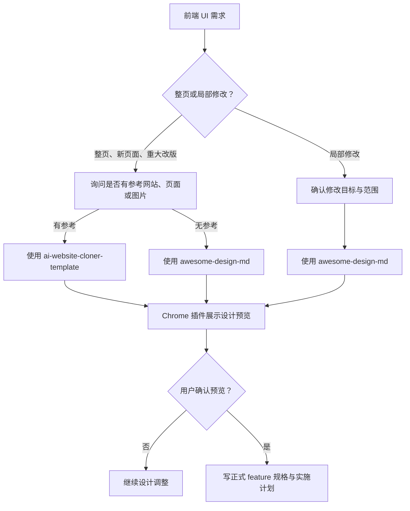

# 前端设计工作流

## 目标

本工作流把前端设计确认放在正式 feature 规格、实施计划和代码实现之前，防止 Agent 在没有参考确认、设计 skill 输出和用户预览确认时直接堆页面。

## 适用范围

Frontend Design Gate 适用于以下前端任务：

- 整页 UI 设计。
- 新页面设计。
- 重大视觉改版。
- 已有页面或组件的局部 UI 修改。

纯文案修正、无视觉影响的代码整理和不改变页面体验的缺陷修复，按当前 feature、计划和质量门槛判断是否需要进入本工作流。

## 硬约束

- 设计阶段所需 skill 是硬依赖；缺失时暂停，不使用替代流程绕过。
- 设计预览必须通过 Chrome 插件展示给用户检查。
- 用户确认设计预览前，不写正式前端 feature 规格，不写实施计划，不进入前端代码实现。
- 设计预览确认只决定设计方向是否可以固化，不能替代实现完成后的浏览器 QA。

## 设计分流

### 整页、新页面和重大改版

1. 在设计前先询问用户是否有参考网站、参考页面或参考图片。
2. 若用户提供参考 URL、页面或图片，使用 `ai-website-cloner-template` 进入设计阶段。
3. 若用户没有参考页面或参考素材，使用 `awesome-design-md` 进入设计阶段。
4. 使用 Chrome 插件展示设计预览，等待用户检查与确认。

### 局部 UI 修改

1. 先确认要修改的页面区域、修改目标和不做范围。
2. 使用 `awesome-design-md` 进入设计阶段。
3. 使用 Chrome 插件展示设计预览，等待用户检查与确认。

## Skill 缺失时暂停

若当前 Agent 平台不能使用当前分支所需 skill，必须停在设计门前：

- 说明缺失的是 `ai-website-cloner-template` 还是 `awesome-design-md`。
- 说明当前任务停在整页参考设计、无参考设计或局部 UI 设计哪一个分支。
- 等待用户选择安装、启用或补齐对应 skill 后继续。
- 不用其他设计流程替代指定 skill，也不直接跳到正式规格、实施计划或前端代码实现。

## 用户确认后的固化内容

设计预览获用户确认后，正式 feature 规格或实施计划至少记录：

- 参考来源，或明确记录本次没有参考素材。
- 采用的设计路径：`ai-website-cloner-template` 或 `awesome-design-md`。
- 用户已确认的页面范围、局部区域和关键设计方向。
- 后续实现需要验证的桌面端、移动端、主要交互、空态和错误态范围。

## 与实现验证的边界

设计阶段的 Chrome 预览确认发生在正式前端规格和实施计划之前。前端代码实现完成后，仍需按 `docs/testing/README.md` 执行对应 lint、typecheck、测试和浏览器 QA，并记录实现后的检查范围。
