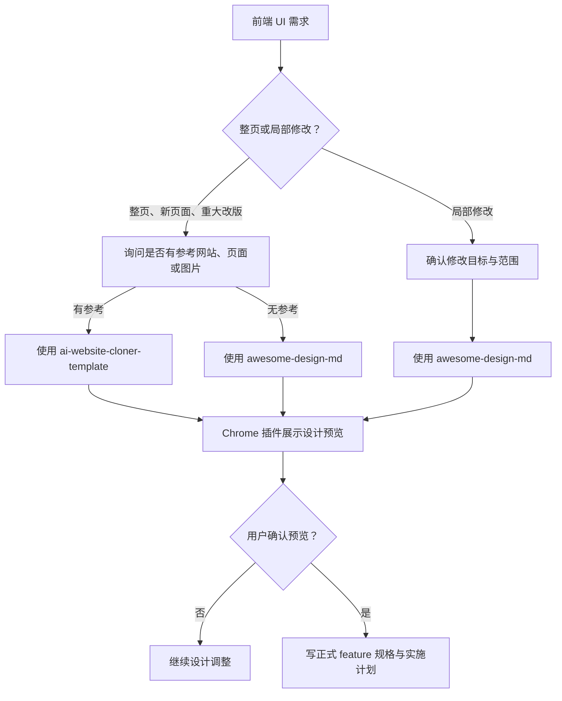

# Prompt Hub 前端设计门落库实施计划

> **For agentic workers:** REQUIRED SUB-SKILL: Use superpowers:subagent-driven-development (recommended) or superpowers:executing-plans to implement this plan task-by-task. Steps use checkbox (`- [ ]`) syntax for tracking.

**目标：** 将已确认的 Frontend Design Gate 写入 Prompt Hub 的 harness 执行文档，使后续前端任务在参考素材确认、指定 skill 设计、Chrome 预览确认和正式规格/计划之间有不可跳过的顺序约束。

**架构：** 本计划是 `M0-002` Harness 治理的规则补强，只修改 harness 文档，不实现产品 UI。先更新 feature 验收来源，再创建前端设计工作流文档，最后把硬门槛接入 `AGENTS.md` 与测试门槛说明，确保设计确认和实现后 QA 不再混成同一件事。

**技术栈：** Markdown、Git、PowerShell、Prompt Hub 现有 harness 文档。

---

## 0. 执行边界

- 必读规格：`docs/superpowers/specs/2026-05-21-prompt-hub-harness-governance-design.zh-CN.md`。
- 必读 feature：`docs/features/M0-002-harness-governance.md`。
- 本计划只落前端设计流程规则，不开发页面、组件、样式、AI 工具、数据库字段或第三方 provider。
- `ai-website-cloner-template` 与 `awesome-design-md` 在本规则中是硬依赖；执行时若当前 Agent 平台缺少对应 skill，停在设计门前并向用户说明，不得自行换流程绕过。
- 本计划不修改 `progress.md` 与 `feature_list.json`：当前业务阶段仍是 `M1-001` 已完成，本次只是已完成 harness feature 的规则补强，不切换产品进度状态。
- 面向人的文档默认中文；skill 名称、插件名称、路径和命令保留英文。

## 1. 文件结构

本计划会创建或修改：

```text
AGENTS.md
docs/
|-- design/
|   `-- frontend-design-workflow.md
|-- features/
|   `-- M0-002-harness-governance.md
|-- testing/
|   `-- README.md
`-- superpowers/
    `-- plans/
        `-- 2026-05-22-prompt-hub-frontend-design-gate.zh-CN.md
```

各文件职责：

| 文件 | 职责 |
| --- | --- |
| `docs/features/M0-002-harness-governance.md` | 将 Frontend Design Gate 纳入 harness feature 的范围与验收 |
| `docs/design/frontend-design-workflow.md` | 说明整页设计、无参考设计、局部修改、Chrome 预览和缺失 skill 暂停流程 |
| `AGENTS.md` | 写入后续 Agent 必须执行的前端设计硬门槛 |
| `docs/testing/README.md` | 区分设计阶段预览确认与实现完成前的浏览器 QA |

## 2. Task 1：更新 Harness Feature 的规则来源

**Files:**
- Modify: `docs/features/M0-002-harness-governance.md`

- [ ] **Step 1: 补充 feature 范围**

在 `## 范围` 中补充 Frontend Design Gate：

```markdown
- 将前端设计前置门写入 harness：整页设计先确认参考素材，按是否存在参考分流到指定 skill，局部 UI 修改走局部设计流程。
- 明确 Chrome 设计预览获用户确认前，不写正式前端 feature 规格、实施计划或实现代码。
```

- [ ] **Step 2: 补充验收标准**

在 `## 验收标准` 中补充：

```markdown
- 仓库能说明整页 UI、有参考素材、无参考素材和局部 UI 修改各自应走的设计流程。
- 仓库能在指定 skill 缺失时把 Agent 停在设计门前，并要求先补齐对应 skill。
- Chrome 设计预览未获用户确认前，前端任务不会进入正式规格、计划或代码实现。
```

- [ ] **Step 3: 检查 feature 文档引用**

运行：

```powershell
rg -n "Frontend Design Gate|ai-website-cloner-template|awesome-design-md|Chrome|正式前端" docs/features/M0-002-harness-governance.md
```

预期：输出能定位设计门、指定 skill、Chrome 预览和正式规格/计划阻断规则。

- [ ] **Step 4: 提交 feature 来源更新**

运行：

```powershell
git add docs/features/M0-002-harness-governance.md
git commit -m "docs: extend harness feature for frontend design gate"
```

## 3. Task 2：创建前端设计工作流文档

**Files:**
- Create: `docs/design/frontend-design-workflow.md`

- [ ] **Step 1: 写工作流目标与硬约束**

创建 `docs/design/frontend-design-workflow.md`，开头说明：

```markdown
# 前端设计工作流

## 目标

本工作流把前端设计确认放在正式 feature 规格、实施计划和代码实现之前，防止 Agent 在没有参考确认、设计 skill 输出和用户预览确认时直接堆页面。

## 硬约束

- 设计门适用于整页 UI、新页面、重大视觉改版和局部 UI 修改。
- 设计阶段所需 skill 是硬依赖；缺失时暂停，不使用替代流程绕过。
- 设计预览必须通过 Chrome 插件展示给用户检查。
- 用户确认设计预览前，不写正式前端 feature 规格，不写实施计划，不进入前端代码实现。
```

- [ ] **Step 2: 写三条设计分流**

在工作流文档中写清：

1. 整页 UI、新页面或重大视觉改版先询问用户是否有参考网站、参考页面或参考图片。
2. 用户提供参考 URL、页面或图片时，使用 `ai-website-cloner-template` 进入设计阶段。
3. 用户没有参考页面或参考素材时，使用 `awesome-design-md` 进入设计阶段。
4. 局部 UI 修改先确认目标与范围，再使用 `awesome-design-md`。

建议用 Mermaid 表示分流：



- [ ] **Step 3: 写缺失 skill 与确认记录要求**

在工作流文档中补充：

- skill 缺失时的暂停话术目标：说明缺失项、说明当前停在哪个设计门、等待用户选择安装或补齐后继续。
- 预览确认后，正式规格或计划中至少记录参考来源、已选设计路径、确认过的页面范围和后续实现验证范围。
- 实现完成后的浏览器 QA 仍按 `docs/testing/README.md` 执行，不用设计预览确认替代实现验证。

- [ ] **Step 4: 检查设计工作流覆盖面**

运行：

```powershell
rg -n "有参考|无参考|局部 UI|ai-website-cloner-template|awesome-design-md|Chrome|暂停|正式 feature 规格|浏览器 QA" docs/design/frontend-design-workflow.md
```

预期：输出覆盖三条设计分流、缺失 skill 暂停、Chrome 预览确认和实现后 QA 边界。

- [ ] **Step 5: 提交设计工作流文档**

运行：

```powershell
git add docs/design/frontend-design-workflow.md
git commit -m "docs: add frontend design workflow"
```

## 4. Task 3：把 Frontend Design Gate 接入 Agent 执行规则

**Files:**
- Modify: `AGENTS.md`

- [ ] **Step 1: 在阶段门中加入前端设计门**

在 `## Development Gates` 中让前端设计任务显式先过设计门，再进入正式 Spec Gate 与 Plan Gate。写法应保持简短，指向 `docs/design/frontend-design-workflow.md`，避免把整份流程重复塞进阶段门列表。

- [ ] **Step 2: 在前端规则中写硬约束**

在 `## Frontend UI Guardrails` 附近新增 Frontend Design Gate 规则，至少包含：

```markdown
- 整页 UI、新页面或重大视觉改版开始前，先询问用户是否有参考网站、参考页面或参考图片。
- 有参考素材时使用 `ai-website-cloner-template`；无参考素材时使用 `awesome-design-md`。
- 局部 UI 修改先确认修改目标与范围，再使用 `awesome-design-md`。
- 指定 skill 不可用时暂停在设计门前，不使用替代流程绕过。
- 设计预览必须通过 Chrome 插件展示给用户检查。
- 用户确认设计预览前，不写正式前端 feature 规格、实施计划或实现代码。
```

- [ ] **Step 3: 检查 AGENTS 规则可定位**

运行：

```powershell
rg -n "Frontend Design Gate|frontend-design-workflow|ai-website-cloner-template|awesome-design-md|Chrome|设计预览" AGENTS.md
```

预期：输出能从 `AGENTS.md` 直接定位前端设计工作流和硬门槛。

- [ ] **Step 4: 对照规格做自审**

手工核对：

- `AGENTS.md` 没有把 Chrome 设计预览和实现完成前浏览器 QA 混成同一步。
- `AGENTS.md` 没有允许 Agent 在 skill 缺失时用其他设计流程替代。
- `AGENTS.md` 没有把参考页面规则限制成只能输入 URL，仍允许页面或图片。
- `AGENTS.md` 仍保留用户当前明确指令的最高优先级。

- [ ] **Step 5: 提交 Agent 规则**

运行：

```powershell
git add AGENTS.md
git commit -m "docs: gate frontend design before planning"
```

## 5. Task 4：区分设计预览与实现后浏览器 QA

**Files:**
- Modify: `docs/testing/README.md`

- [ ] **Step 1: 在前端质量门槛中补设计阶段说明**

在测试文档的前端相关章节说明：

- 设计阶段的 Chrome 预览确认发生在正式前端规格和计划之前。
- 设计预览确认只证明设计方向被用户接受，不替代实现后的 lint、typecheck、测试和浏览器检查。

- [ ] **Step 2: 保持实现后 QA 清单**

保留 `## 前端浏览器检查` 对路由、桌面端、移动端、交互、错误态和空态的记录要求，并明确这属于实现完成前验证。

- [ ] **Step 3: 检查测试文档边界**

运行：

```powershell
rg -n "设计预览|Chrome|正式前端|浏览器检查|lint|typecheck|桌面端|移动端" docs/testing/README.md
```

预期：输出能同时定位设计确认与实现验证，两者没有互相替代。

- [ ] **Step 4: 提交质量门槛更新**

运行：

```powershell
git add docs/testing/README.md
git commit -m "docs: separate design preview from frontend qa"
```

## 6. Task 5：最终验证与交接

**Files:**
- Verify: `docs/features/M0-002-harness-governance.md`
- Verify: `docs/design/frontend-design-workflow.md`
- Verify: `AGENTS.md`
- Verify: `docs/testing/README.md`

- [ ] **Step 1: 检查文档 diff**

运行：

```powershell
git diff --check HEAD~4..HEAD
```

预期：退出码为 `0`，没有空白或 patch 格式问题。

- [ ] **Step 2: 检查占位词**

运行：

```powershell
rg -n "TODO|TBD|待补|占位" AGENTS.md docs/features/M0-002-harness-governance.md docs/design/frontend-design-workflow.md docs/testing/README.md
```

预期：没有未解释的占位内容；若输出来自示例文本，先确认其语义不会让后续 Agent 误判为待办。

- [ ] **Step 3: 对照规格逐项核对**

核对：

- 整页 UI 前会先询问参考网站、页面或图片。
- 有参考素材会走 `ai-website-cloner-template`。
- 无参考素材会走 `awesome-design-md`。
- 局部 UI 修改会走 `awesome-design-md`。
- skill 缺失会暂停。
- Chrome 设计预览获用户确认前不会写正式前端规格、计划或代码。
- 实现完成前浏览器 QA 仍保留独立验证要求。

- [ ] **Step 4: 查看工作树状态**

运行：

```powershell
git status --short --branch
```

预期：只剩执行前就存在的已知无关变更；不要把无关的 `next-env.d.ts` 生成改动带进本次 harness 提交。

## 7. Review 与完成门

完成前做两轮核对：

1. 规格符合性检查：
   - 所有分流是否与 harness 规格一致。
   - 正式规格/计划/实现的阻断点是否写清。
   - Chrome 设计预览和实现后 QA 是否分层。
2. 文档质量检查：
   - `AGENTS.md` 是否足够短而可执行。
   - 工作流文档是否能让其他 Agent 平台在没有聊天上下文时照着走。
   - feature 文档是否表达了新规则属于 harness 范围，而不是产品 UI 实现。
